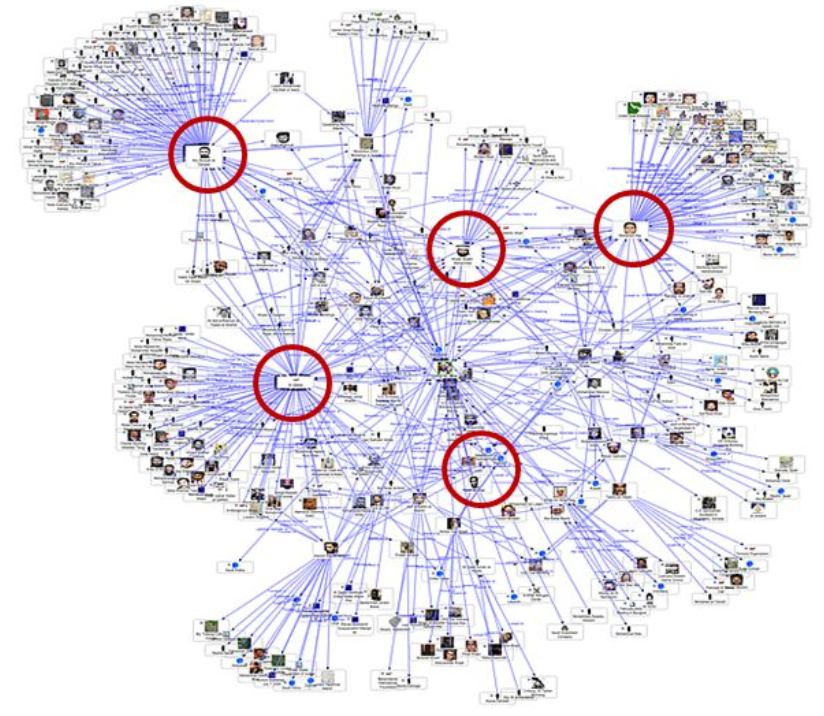

# Influence Maximization and Learning papers
 
 

  

 
*Image from <a href=https://slideplayer.com/slide/5260408/>Ding Zhu-Du</a> 

A list of influence maximization and influence learning papers, organized based on the type of data they rely on, their aim and their constraints:

- Static network
- Time constraint
- Location constraint
- Topic constraint
- Competitive
- Dynamic network 
- Ground-truth cascades 
- Adaptive
- Influence learning 
- Learning and Maximization
- Surveys
<!--- - Datasets -->

## Static network

- **Mining the network value of customers**
  - Domingos, Pedro and Richardson, Matt
  - KDD 2001 [[Paper]](https://homes.cs.washington.edu/~pedrod/papers/kdd01a.pdf)

- **Maximizing the spread of influence through a social network**
  - Kempe, David and Kleinberg, Jon and Tardos, Eva
  - KDD 2003 [[Paper]](https://www.cs.cornell.edu/home/kleinber/kdd03-inf.pdf)

- **Influential nodes in a diffusion model for social networks**
  - Kempe, David and Kleinberg, Jon and Tardos, Eva
  - ICALP2005 [[Paper]](http://www.leonidzhukov.net/hse/2015/networks/papers/icalp05-inf.pdf)

- **On the submodularity of influence in social networks**
  - Mossel, Elchanan and Roch, Sebastien
  - Theory of computing 2007 [[Paper]](https://arxiv.org/pdf/math/0612046.pdf)

- **Cost-effective outbreak detection in networks**
  - Leskovec, Jure and Krause, Andreas and Guestrin, Carlos and Faloutsos, Christos and VanBriesen, Jeanne and Glance, Natalie
  - KDD 2008 [[Paper]](https://www.cs.cmu.edu/~jure/pubs/detect-kdd07.pdf)

- **Efficient influence maximization in social networks**
  - Chen, Wei and Wang, Yajun and Yang, Siyu
  - KDD 2009 [[Paper]](http://snap.stanford.edu/class/cs224w-readings/chen09influence.pdf)

- **Scalable influence maximization for prevalent viral marketing in large-scale social networks**
  - Chen, Wei and Wang, Chi and Wang, Yajun
  - KDD 2010 [[Paper]](https://www.microsoft.com/en-us/research/wp-content/uploads/2016/02/msr-tr-2010-2_v2.pdf)

- **Simpath: An efficient Algorithm for Influence Maximization under the Linear Threshold model**
  - Goyal, Amit and Lu, Wei and Lakshmanan, Laks VS
  - ICDM 2011 [[Paper]](http://citeseerx.ist.psu.edu/viewdoc/download?doi=10.1.1.722.4522&rep=rep1&type=pdf)

- ** Simulated annealing based influence maximization in social networks **
    - Jiang, Qingye, Guojie Song, Cong Gao, Yu Wang, Wenjun Si, and Kunqing Xie
    - AAAI 2011.

- **Irie: Scalable and robust influence maximization in social networks**
    - Jung, Kyomin, Wooram Heo, and Wei Chen
    - ICDM 2012

- **Scalable and parallelizable processing of influence maximization for large-scale social networks?**
	- Kim, Jinha and Kim, Seung-Keol and Yu, Hwanjo
	- ICDE 2013

- **Staticgreedy: solving the scalability-accuracy dilemma in influence maximization**
	- Cheng, Suqi and Shen, Huawei and Huang, Junming and Zhang, Guoqing and Cheng, Xueqi
	- CIKM 2013 [[Paper]](https://arxiv.org/pdf/1212.4779.pdf)

- **On budgeted influence maximization in social networks**
    - Nguyen, Huy, and Rong Zheng
    - IEEE Journal on Selected Areas in Communications 2013

- **Latency-Bounded Target Set Selection in Social Networks**
    - Ferdinando, Cicalese, Gennaro Cordasco, Gargano Luisa, Milanic Martin, and Vaccaro Ugo
    - Theoretical Computer Science 2013

- **Fast and accurate influence maximization on large networks with pruned monte-carlo simulations**
	- Ohsaka, Naoto and Akiba, Takuya and Yoshida, Yuichi and Kawarabayashi, Ken-ichi
	- AAAI 2014 [[Paper]](https://www.aaai.org/ocs/index.php/AAAI/AAAI14/paper/viewFile/8455/8411)

- **Maximizing social influence in nearly optimal time**
  - Borgs, Christian and Brautbar, Michael and Chayes, Jennifer and Lucier, Brendan
  - SODA 2014 [[Paper]](https://arxiv.org/pdf/1212.0884.pdf)

- **IMRank: influence maximization via finding self-consistent ranking**
  - Cheng, Suqi and Shen, Huawei and Huang, Junming and Chen, Wei and Cheng, Xueqi
  - SIGIR 2014 [[Paper]](https://arxiv.org/pdf/1402.3939.pdf) 

- **Sketch-based Influence Maximization and Computation: Scaling up with Guarantees**
  - Cohen, Edith and Delling, Daniel and Pajor, Thomas and Werneck, Renato F
  - CIKM 2014 [[Paper]](https://arxiv.org/pdf/1408.6282.pdf)

- **Influence maximization: Near-optimal time complexity meets practical efficiency**
  - Tang, Youze and Xiao, Xiaokui and Shi, Yanchen
  - SIGMOD 2014 [[Paper]](https://arxiv.org/pdf/1404.0900.pdf)

- **Fast and accurate influence maximization on large networks with pruned monte-carlo simulations**
  - Ohsaka, Naoto and Akiba, Takuya and Yoshida, Yuichi and Kawarabayashi, Ken-ichi
  - AAAI 2014 [[Paper]](https://www.aaai.org/ocs/index.php/AAAI/AAAI14/paper/viewFile/8455/8411)

- **Influence maximization in near-linear time: A martingale approach**
  - Tang, Youze and Shi, Yanchen and Xiao, Xiaokui
  - SIGMOD 2015

- **A genetic newgreedy algorithm for influence maximization in social network**
	- Tsai, Chun-Wei, Yo-Chung Yang, and Ming-Chao Chiang
	- ICS 2015

- **Asim: A scalable algorithm for influence maximization under the independent cascade model**
    - Galhotra, Sainyam, Akhil Arora, Srinivas Virinchi, and Shourya Roy
    - The WebConf 2015 [[Paper]](https://dl.acm.org/doi/pdf/10.1145/2740908.2742725)

- **Influence maximization in complex networks through optimal percolation**
 	- Morone, Flaviano, and Hernán A. Makse
	- Nature 524, no. 7563 (2015) [[Paper]](https://arxiv.org/pdf/1506.08326.pdf)

- **On the upper bounds of spread for greedy algorithms in social network influence maximization**
  - Zhou, Chuan and Zhang, Peng and Zang, Wenyu and Guo, Li
  - TKDE 2015 [[Paper]](https://www.researchgate.net/publication/277649229_On_the_Upper_Bounds_of_Spread_for_Greedy_Algorithms_in_Social_Network_Influence_Maximization)

- **Better approximation algorithms for influence maximization in online social networks**
    - Zhu, Yuqing, Weili Wu, Yuanjun Bi, Lidong Wu, Yiwei Jiang, and Wen Xu
    - Journal of Combinatorial Optimization 2015

- **A fast and effective heuristic for discovering small target sets in social networks**
    - Cordasco, Gennaro, Luisa Gargano, Marco Mecchia, Adele A. Rescigno, and Ugo Vaccaro
    - Combinatorial Optimization and Applications 2015

- **A fast algorithm for finding most influential people based on the linear threshold model**
    - Rahimkhani, Khadije, Abolfazl Aleahmad, Maseud Rahgozar, and Ali Moeini
    - Expert Systems with Applications 2015

- **Influence maximization in social networks with genetic algorithms**
    - Bucur, Doina, and Giovanni Iacca
    - European conference on the applications of evolutionary computation 2016 [[Paper]](https://www.researchgate.net/profile/Giovanni_Iacca/publication/314944120_Influence_Maximization_in_Social_Networks_with_Genetic_Algorithms/links/5bb5b333299bf13e605dc3df/Influence-Maximization-in-Social-Networks-with-Genetic-Algorithms.pdf)

- **Stop-and-stare: Optimal sampling algorithms for viral marketing in billion-scale networks**
  - Nguyen, Hung T and Thai, My T and Dinh, Thang N
  - SIGMOD 2016 [[Paper]](https://www.researchgate.net/publication/277649229_On_the_Upper_Bounds_of_Spread_for_Greedy_Algorithms_in_Social_Network_Influence_Maximization)

- **Influence Maximization in Social Networks Based on Discrete Particle Swarm Optimization**
    - Gonga, Maoguo, Jianan Yana, Bo Shena, Lijia Maa, and Qing Caia. "." (2016).
    - Information Sciences 2016 [[Paper]](https://www.researchgate.net/profile/Qing_Cai6/publication/305038563_Influence_Maximization_in_Social_Networks_Based_on_Discrete_Particle_Swarm_Optimization/links/5d818a85299bf10c1ab5a28c/Influence-Maximization-in-Social-Networks-Based-on-Discrete-Particle-Swarm-Optimization.pdf)
     
- **Holistic influence maximization: Combining scalability and efficiency with opinion-aware models**
    - Galhotra, Sainyam, Akhil Arora, and Shourya Roy
    - SIGMOD 2016

- **Holistic influence maximization: Combining scalability and efficiency with opinion-aware models**
   - Galhotra, Sainyam and Arora, Akhil and Roy, Shourya
   - SIGMOD 2016 [[Paper]](https://arxiv.org/pdf/1602.03110.pdf)

- **INCIM: A community-based algorithm for influence maximization problem under the linear threshold model**
    - Bozorgi, Arastoo, Hassan Haghighi, Mohammad Sadegh Zahedi, and Mojtaba Rezvani.
    - Information Processing & Management 2016
    
- **Diffusion centrality: a paradigm to maximize spread in social networks**
    - Kang, Chanhyun, Sarit Kraus, Cristian Molinaro, Francesca Spezzano, and V. S. Subrahmanian
    - Artificial Intelligence 2016
    
- **Revisiting the stop-and-stare algorithms for influence maximization**
  - Huang, Keke and Wang, Sibo and Bevilacqua, Glenn and Xiao, Xiaokui and Lakshmanan, Laks VS
  - VLDB 2017 [[Paper]](https://pdfs.semanticscholar.org/6d07/996dafc1cb3f20317b17398a058fd62a2683.pdf)

- **Social influence spectrum at scale: near-optimal solutions for multiple budgets at once**
    - Nguyen HT, Ghosh P, Mayo ML, Dinh TN 
    - ACM Transactions on Information Systems 2017

- **Leveraging cross-network information for graph sparsification in influence maximization**
	- Shen, Xiao, Fu-lai Chung, and Sitong Mao
	- SIGIR 2017

- **A billion-scale approximation algorithm for maximizing benefit in viral marketing**
    - Nguyen, Hung T., My T. Thai, and Thang N. Dinh.
    - IEEE/ACM Transactions on Networking 2017

- **On the approximability of influence in social networks** 
    - Chen Ning
    - SIAM J Discrete Math 2017

- **Optimizing influence diffusion in a social network with fuzzy costs for targeting nodes**
  - Ni, Yaodong and Shi, Qiaoni and Wei, Zhiyuan
  - Journal of Ambient Intelligence and Humanized Computing 2017  

- **MATI: An efficient algorithm for influence maximization in social networks**
  - Rossi, Maria-Evgenia G and Shi, Bowen and Tziortziotis, Nikolaos and Malliaros, Fragkiskos D and Giatsidis, Christos and Vazirgiannis, Michalis
  - PloS one 2018

- **An Inapproximability Result for the Target Set Selection Problem on Bipartite Graphs.**
    - Banerjee, Suman, and Rogers Mathew
    - arXiv 2018 [[Paper]](https://arxiv.org/pdf/1812.01482.pdf)

 - **An efficient and effective hop-based approach for influence maximization in social networks**
 	- Tang, Jing, Xueyan Tang, and Junsong Yuan
	- ASONAM 2018

- **Maximizing positive influence spread in online social networks via fluid dynamics**
    - Wang, Feng, Wenjun Jiang, Xiaolin Li, and Guojun Wang
    - Future Generation Computer Systems 2018

- **Scalable Lattice Influence Maximization**
	- Wu, Ruihan, Zheng Yu, and Wei Chen 
	- arXiv 2018 [[Paper]](https://arxiv.org/pdf/1802.04555.pdf)
 
 - **Optimal distributed submodular optimization via sketching**
 	- Bateni, MohammadHossein, Hossein Esfandiari, and Vahab Mirrokni 
	- KDD 2018 [[Paper]](http://mhbateni.com/academic/pubs/cover-mr.pdf)
 
- **Influence Maximization in Signed Social Networks with Opinion Formation**
  - Liang, Wenxin and Shen, Chengguang and Li, Xiao and Nishide, Ryo and Piumarta, Ian and Takada, Hideyuki
  - IEEE Access 2019 [[Paper]](https://ieeexplore.ieee.org/stamp/stamp.jsp?arnumber=8721642)

- **LAPSO-IM: A learning-based influence maximization approach for social networks**
  - Singh, Shashank Sheshar and Kumar, Ajay and Singh, Kuldeep and Biswas, Bhaskar
  - Applied Soft Computing 2019

- **Self-Activation Influence Maximization**
  - Sun, Lichao and Chen, Albert and Yu, Philip S and Chen, Wei
  - arXiv 2019 [[Paper]](https://arxiv.org/pdf/1906.02296.pdf)

- **A Centrality Measure for Influence Maximization Across Multiple Social Networks**
  - Singh, Shashank Sheshar, Ajay Kumar, Shivansh Mishra, Kuldeep Singh, and Bhaskar Biswas
  - Advanced Informatics for Computing Research 2019 [[Paper]](https://link.springer.com/chapter/10.1007/978-981-15-0111-1_18)

- **Accelerating influence maximization using heterogeneous algorithms**
  - Haque, Mridul, and Dip Sankar Banerjee
  - The Journal of Supercomputing 2019 [[Paper]](https://link.springer.com/article/10.1007/s11227-019-03061-8)

- **Efficient Influence Maximization Under Network Uncertainty**
  - Eshghi, Soheil, Setareh Maghsudi, Valerio Restocchi, Sebastian Stein, and Leandros Tassiulas
  - INFOCOM 2019 [[Paper]](https://www.research.ed.ac.uk/portal/files/82194312/Efficient_Influence_Maximization_ESHGI_DoA220219_AFV.pdf)

- **Influence Maximization on Large-Scale Networks with a Group-Based Method via Network Embedding**
   - Ji, Yaoxuan, Li Pan, and Peng Wu
   - DSC 2019
	
- **A Multi-criteria Approximation Algorithm for Influence Maximization with Probabilistic Guarantees**
	- Khan, Maleq, Gopal Pandurangan, Nguyen Dinh Pham, Anil Vullikanti, and Qin Zhang
	- SIAM ALENEX 2019

- **"Robust Influence Maximization for Hyperparametric Models**
	- Kalimeris, Dimitris, Gal Kaplun, and Yaron Singer
	- ICML 2019 [[Paper]](https://arxiv.org/pdf/1903.03746.pdf)

- **An Exact Algorithm for Robust Influence Maximization**
	- Nannicini, Giacomo, Giorgio Sartor, Emiliano Traversi, and Roberto Wolfler-Calvo
	- Integer Programming and Combinatorial Optimization 2019

- **Tiptop:(almost) exact solutions for influence maximization in billion-scale networks**
	-  Li, Xiang, J. David Smith, Thang N. Dinh, and My T. Thai. 
	- Transactions on Networking 2019 [[Paper]](https://dl.acm.org/ft_gateway.cfm?id=3333704&type=pdf)

- **Group-fairness in influence maximization**
	- Tsang, Alan, Bryan Wilder, Eric Rice, Milind Tambe, and Yair Zick
	- arXiv 2019[[Paper]](https://arxiv.org/pdf/1903.00967.pdf)

- **Adversarial Graph Embeddings for Fair Influence Maximization over Social Networks**
	- Khajehnejad, Moein, Ahmad Asgharian Rezaei, Mahmoudreza Babaei, Jessica Hoffmann, Mahdi Jalili, and Adrian Weller
	- IJCAI 2020[[Paper]](https://arxiv.org/pdf/2005.04074.pdf)

- **Sample Complexity Bounds for Influence Maximization**
	- Sadeh, Gal, Edith Cohen, and Haim Kaplan
	- ITCS 2020 [[Paper]](https://drops.dagstuhl.de/opus/volltexte/2020/11714/pdf/LIPIcs-ITCS-2020-29.pdf)

- **Sample Complexity Bounds for Influence Maximization**
	- Sadeh, Gal, Edith Cohen, and Haim Kaplan
	- ITCS 2020 [[Paper]](https://drops.dagstuhl.de/opus/volltexte/2020/11714/pdf/LIPIcs-ITCS-2020-29.pdf)

- **Earned Benefit Maximization in Social Networks Under Budget Constraint**
	- Banerjee, Suman, Mamata Jenamani, and Dilip Kumar Pratihar
	- arXiv 2020 [[Paper]](https://arxiv.org/pdf/2004.04003.pdf)
	
- **Continuous Influence Maximization**
	- Yang, Y., Mao, X., Pei, J., & He, X.
	- TKDD 2020 [[Paper]](https://dl.acm.org/doi/pdf/10.1145/3380928?casa_token=JEC8EGO2BfkAAAAA:rXGteU7yRcF8GX07XhZaw1wwGOrS3Q3VbeW_gEl33RsP6GxDap_bnwCMphLGH5bs7czeUE2L1OnfHAc)

- **Targeted Influence Maximization Based on Cloud Computing Over Big Data in Social Networks**
	- Chen, Shiyu, Xiaochun Yin, Qi Cao, Qianmu Li, and Huaqiu Long
	- IEEE Access 2020 [[Paper]](https://ieeexplore.ieee.org/document/9024036)

-  **Influence maximization through user interaction modeling**
	- Oriedi, David, Cyril de Runz, Zahia Guessoum, Amine Aït Younes, and Henry Nyongesa
	- ACM SAC 2020

- **A Unifying Framework for Fairness-Aware Influence Maximization**
	- Farnad, Golnoosh, Behrouz Babaki, and Michel Gendreau
	- The WebConf 2020 [[Paper]](https://dl.acm.org/doi/pdf/10.1145/3366424.3383555)

- **The Solution Distribution of Influence Maximization: A High-level Experimental Study on Three Algorithmic Approaches**
	- Ohsaka, Naoto
	- SIGMOD 2020 [[Paper]](https://dl.acm.org/doi/abs/10.1145/3318464.3380564)

- **Influence Maximization Revisited: Efficient Reverse Reachable Set Generation with Bound Tightened.**
	-  Guo, Qintian, Sibo Wang, Zhewei Wei, and Ming Chen. 
	-  SIGMOD 2020 [[Paper]](http://www1.se.cuhk.edu.hk/~swang/sigmod2020-subsim.pdf)
	
- **Cores matter? An analysis of graph decomposition effects on influence maximization problems**
	- Caliò, Antonio, Andrea Tagarelli, and Francesco Bonch
	- Web Science 2020

- **CutTheTail: An Accurate and Space-Efficient Heuristic Algorithm for Influence Maximization**
	- Popova, Diana, Ken-ichi Kawarabayashi, and Alex Thomo
	- The Computer Journal 2020

- **A Unifying Framework for Fairness-Aware Influence Maximization**
	- Farnad, Golnoosh, Behrouz Babaki, and Michel Gendreau
	- Web Science 2020[[Paper]](https://dl.acm.org/doi/pdf/10.1145/3366424.3383555)

- **Improving Fairness of Influence Maximization in Social Networks Using Grey Wolf Optimizer**
	- Razzaghi, Behnam, and Mehdy Roayaei Ardakany
	- JEWR 2020 [[Paper]](https://www.sid.ir/FileServer/SF/9771399H0609.pdf)

- **Influence Maximization with Priority in Online Social Networks**
	- Pham, Canh V., Dung KT Ha, Quang C. Vu, Anh N. Su, and Huan X. Hoang
	- Algorithms 2020 [[Paper]](https://www.mdpi.com/1999-4893/13/8/183/pdf)

- **Geodemographic Influence Maximization**
	- Zhang, Kaichen, Jingbo Zhou, Donglai Tao, Panagiotis Karras, Qing Li, and Hui Xiong
	- KDD 2020 [[Paper]](http://zhoujingbo.github.io/paper/kdd2020_geodemographic_zhang.pdf)

- **Taxonomy of Influence Maximization Techniques in Unknown Social Networks**
	- Ahamed, B. Bazeer, and Sudhakaran Periakaruppan 
	- In Research Advancements in Smart Technology, Optimization, and Renewable Energy (pp. 351-363) 2020

- **Influence Maximization: Seeding Based on Community Structure**
	- Guo, Jianxiong, and Weili Wu. 
 	- ACM TKDD 2020 [Paper](https://dl.acm.org/doi/abs/10.1145/3399661?casa_token=chq634nzdAUAAAAA%3AB1JrcBbmc_WC4C-mqzi_jr6tiYidC233eKq-EEISyMVHKl0PVQOGwgYANrJo6qLxPOmjS7R2aUrPvqQ)

- **Balanced Influence Maximization in Attributed Social Network Based on Sampling**
	- Lin, Mingkai, Wenzhong Li, and Sanglu Lu
	- WSDM 2020 [Paper](https://dl.acm.org/doi/pdf/10.1145/3336191.3371833?casa_token=RxPHxOsQvosAAAAA:l4iOp2Z8TvZMxOHdxsIs4SXs56j1hBNplwjJBnSDoDW274J0pqkeqrverbpryOO8rEdeq9Re48yXBLA)

- **Influence maximization with spontaneous user adoption**
	- Sun, Lichao, Albert Chen, Philip S. Yu, and Wei Chen
 	- WSDM 2020 [Paper](https://dl.acm.org/doi/pdf/10.1145/3336191.3371791?casa_token=zTjEG1_x78sAAAAA:ask8S8_5Cx5zC6DGCvmnfkrv2iHkczAhc8cuT3oERm-Lp2ekH1ZFlT6vc3KiXm2wZw7qfyWLL57pRaA)
	
- **Matching Influence Maximization in Social Networks**
	- Rao, Guoyao, Yongcai Wang, Wenping Chen, Deying Li, and Weili Wu
	- Theoretical Computer Science 2020 [[Paper]](https://www.sciencedirect.com/science/article/pii/S0304397520307714?casa_token=VqfHi-E7jLoAAAAA:lxFOWWcO-nAUpXw9Uu47sgNjOPXcda-36x0UMUyOVCQakqRbEmJtpplgdf4yBz43bSNO7HXtmjf8)
	
- **Correlation Robust Influence Maximization**
	- Chen, Louis, Divya Padmanabhan, Chee Chin Lim, and Karthik Natarajan.
	- NeurIPS 2020 [[Paper]](https://arxiv.org/pdf/2010.14620.pdf)

- **Online Influence Maximization under Linear Threshold Model**
	- Li, Shuai, Fang Kong, Kejie Tang, Qizhi Li, and Wei Chen
	- NeurIPS 2020 [[Paper]](https://arxiv.org/pdf/2011.06378.pdf)
	
- **Efficient presolving methods for influence maximization problem in social networks**
	- Chen, Sheng-Jie, Wei-Kun Chen, Yu-Hong Dai, Jian-Hua Yuan, and Hou-Shan Zhang
	- arXiv 2021 [[Paper]](https://arxiv.org/pdf/2101.00393.pdf)

## Time constraint

- **Time-critical influence maximization in social networks with time-delayed diffusion process**
  - Chen, Wei and Lu, Wei and Zhang, Ning
  - AAAI 2012 [[Paper]](http://citeseerx.ist.psu.edu/viewdoc/download?doi=10.1.1.879.8645&rep=rep1&type=pdf)

- **Time constrained influence maximization in social networks**
  - Liu, Bo and Cong, Gao and Xu, Dong and Zeng, Yifeng
  - ICDM 2012 [[Paper]](https://ieeexplore.ieee.org/stamp/stamp.jsp?arnumber=6413881)

- **Influence diffusion dynamics and influence maximization in social networks with friend and foe relationships**
  - Li, Yanhua and Chen, Wei and Wang, Yajun and Zhang, Zhi-Li
  - WSDM 2013 [[Paper]](https://arxiv.org/pdf/1111.4729.pdf)
	
- **Influence spreading path and its application to the time constrained social influence maximization problem and beyond**
  - Liu, Bo and Cong, Gao and Zeng, Yifeng and Xu, Dong and Chee, Yeow Meng
  - TKDE 2013 [[Paper]](https://ieeexplore.ieee.org/stamp/stamp.jsp?arnumber=6547147)

- **Maximizing rumor containment in social networks with constrained time**
  - Fan, Lidan and Wu, Weili and Zhai, Xuming and Xing, Kai and Lee, Wonjun and Du, Ding-Zhu
  - ASONAM 2014 [[Paper]](https://link.springer.com/content/pdf/10.1007%2Fs13278-014-0214-4.pdf)

- **Influence spreading path and its application to the time constrained social influence maximization problem and beyond**
  - Liu, Bo and Cong, Gao and Zeng, Yifeng and Xu, Dong and Chee, Yeow Meng
  - TKDE 2014 [[Paper]](http://tees.openrepository.com/tees/bitstream/10149/592745/2/592745.pdf)

- **Cost-effective viral marketing for time-critical campaigns in large-scale social networks**
  - Dinh, Thang N and Zhang, Huiyuan and Nguyen, Dzung T and Thai, My T
  - Transactions on Networking 2014 [[Paper]](https://ieeexplore.ieee.org/stamp/stamp.jsp?arnumber=6678627)

- **Influence maximization with novelty decay in social networks**
  - Feng, Shanshan and Chen, Xuefeng and Cong, Gao and Zeng, Yifeng and Chee, Yeow Meng and Xiang, Yanping
  - AAAI 2014 [[Paper]](https://www.aaai.org/ocs/index.php/AAAI/AAAI14/paper/download/8485/8396)

- **Time-sensitive influence maximization in social networks**
  - Mohammadi, Azadeh and Saraee, Mohamad and Mirzaei, Abdolreza
  - Journal of Information Science 2015 [[Paper]](http://usir.salford.ac.uk/id/eprint/37193/7/JIS-3187-accepted.pdf)

- **DynaDiffuse: A Dynamic Diffusion Model for Continuous Time Constrained Influence Maximization**
  - Xie, Miao and Yang, Qiusong and Wang, Qing and Cong, Gao and De Melo, Gerard
  - AAAI 2015 [[Paper]](https://www.aaai.org/ocs/index.php/AAAI/AAAI15/paper/viewPDFInterstitial/9940/9265)

- **Credit distribution for influence maximization in online social networks with time constraint**
  - Pan, Yan and Deng, Xiaoheng and Shen, Hailan
  - Smartcity 2015

- **Towards time-discounted influence maximization**
  - Khan, Arijit
  - CIKM 2016 [[Paper]](http://www.ntu.edu.sg/home/arijit.khan/Papers/TimeInf_CIKM16.pdf)

- **Maximizing time-decaying influence in social networks**
  - Ohsaka, Naoto and Yamaguchi, Yutaro and Kakimura, Naonori and Kawarabayashi, Ken-Ichi
  - ECML/PKDD 2016 [[Paper]](https://pdfs.semanticscholar.org/7124/85b1dca37377a4b94cdd814b04f73df23ecd.pdf)

- **Time-sensitive influence maximization in social networks**
  - Min Hu, Qin Liu, Hejiao Huang, Xiaohua Jia
  - ICCT 2018 [[Paper]](https://ieeexplore.ieee.org/stamp/stamp.jsp?arnumber=8600272)
  
- **Influence Maximization: A Time-Space Efficient Algorithm**
  - Xia, Ganming
  - Materials Science and Engineering 2019 [[Paper]](https://iopscience.iop.org/article/10.1088/1757-899X/533/1/012048/pdf) 

- **On the Fairness of Time-Critical Influence Maximization in Social Networks**
  - Ali, Junaid and Babaei, Mahmoudreza and Chakraborty, Abhijnan and Mirzasoleiman, Baharan and Gummadi, Krishna P and Singla, Adish
  - arXiv 2019 [[Paper]](https://arxiv.org/pdf/1905.06618.pdf)

- **Influence maximization on undirected graphs: Towards closing the (1-1/e) gap**
	 - Schoenebeck, Grant, and Biaoshuai Tao
	 - CEC 2019 [[Paper]](https://dl.acm.org/citation.cfm?id=3329650)

## Location constraint

- **Efficient location-aware influence maximization**
  - Li, Guoliang and Chen, Shuo and Feng, Jianhua and Tan, Kian-lee and Li, Wen-syan
  - SIGMOD 2014 [[Paper]](http://citeseerx.ist.psu.edu/viewdoc/download?doi=10.1.1.493.9040&rep=rep1&type=pdf)

- **Location-based influence maximization in social networks**
  - Zhou, Tao and Cao, Jiuxin and Liu, Bo and Xu, Shuai and Zhu, Ziqing and Luo, Junzhou
  - CIKM 2015 [[Paper]](https://www.researchgate.net/publication/301417935_Location-Based_Influence_Maximization_in_Social_Networks)

- **Influence maximization in trajectory databases**
	- Guo, Long and Zhang, Dongxiang and Cong, Gao and Wu, Wei and Tan, Kian-Lee
	- TKDE 2016 [[Paper]](http://www.gntsuntechnologies.com/Projects/2017_java_ieee/07.pdf)
	
- **Distance-aware influence maximization in geo-social network**
  - Wang, Xiaoyang and Zhang, Ying and Zhang, Wenjie and Lin, Xuemin
  - ICDE 2016

- **Efficient distance-aware influence maximization in geo-social networks**
  - Wang, Xiaoyang and Zhang, Ying and Zhang, Wenjie and Lin, Xuemin
  - TKDE 2016

- **Geo-social influence spanning maximization**
  - Li, Jianxin and Sellis, Timos and Culpepper, J Shane and He, Zhenying and Liu, Chengfei and Wang, Junhu
  - TKDE 2017
  
- **Location-aware targeted influence maximization in social networks**
  - Su, Sen and Li, Xiao and Cheng, Xiang and Sun, Chenna
  - Association for Information Science and Technology 2018

- **Community-based seeds selection algorithm for location aware influence maximization**
    - Li, Xiao, Xiang Cheng, Sen Su, and Chenna Sun 
    - Neurocomputing 2018

- **Topology-driven diversity for targeted influence maximization with application to user engagement in social networks**
  - Caliò, Antonio, Roberto Interdonato, Chiara Pulice, and Andrea Tagarelli
  - TKDE 2018 [[Paper]](https://arxiv.org/pdf/1804.07719.pdf)

- **Location-aware influence maximization over dynamic social streams**
  - Wang, Yanhao and Li, Yuchen and Fan, Ju and Tan, Kian-Lee
  - TOIS 2018 [[Paper]](https://ink.library.smu.edu.sg/cgi/viewcontent.cgi?article=5159&context=sis_research)

- **Multi-location Influence Maximization in Location-Based Social Networks**
  - Zhang, Zhen and Zhao, Xiangguo and Wang, Guoren and Bi, Xin
  - APWeb 2018
  

## Topic constraint

- **Topic-aware social influence propagation models**
	- Barbieri, Nicola and Bonchi, Francesco and Manco, Giuseppe
	- Knowledge and information systems 2013

- **Social influence analysis in large-scale networks**
	- Tang, Jie and Sun, Jimeng and Wang, Chi and Yang, Zi
	- KDD 2019 [[Paper]](https://cis.temple.edu/~wu/teaching/Spring%202015/KDD09_Social_Influence_Analysis.pdf)

- **Online Topic-aware Influence Maximization Queries**
	- Aslay, Cigdem and Barbieri, Nicola and Bonchi, Francesco and Baeza-Yates, Ricardo A
	- EDBT 2014 [[Paper]](https://www.researchgate.net/profile/Nicola_Barbieri2/publication/261374754_Online_Topic-aware_Influence_Maximization_Queries/links/0deec5342505dbdfc4000000/Online-Topic-aware-Influence-Maximization-Queries.pdf)

- **Scalable topic-specific influence analysis on microblogs**
	- Bi, Bin and Tian, Yuanyuan and Sismanis, Yannis and Balmin, Andrey and Cho, Junghoo
	- WSDM 2014 [[Paper]](http://oak.cs.ucla.edu/~cho/papers/wsdm2014.pdf)

- **Efficient topic-aware influence maximization using preprocessing**
	- Chen, Wei and Lin, Tian and Yang, Cheng
	- Corr 2014 [[Paper]](http://citeseerx.ist.psu.edu/viewdoc/download?doi=10.1.1.759.2478&rep=rep1&type=pdf)
	
- **Online topic-aware influence maximization**
	- Chen, Shuo and Fan, Ju and Li, Guoliang and Feng, Jianhua and Tan, Kian-lee and Tang, Jinhui
	- VLDB 2015 [[Paper]](https://pdfs.semanticscholar.org/0844/19435227a5bbf54d47ba54e11739756510fd.pdf)

- **Microblogging content propagation modeling using topic-specific behavioral factors**
	- Hoang, Tuan-Anh and Lim, Ee-Peng
	- TKDE 2016 [[Paper]](https://ink.library.smu.edu.sg/cgi/viewcontent.cgi?article=4574&context=sis_research)

- **Real-time topic-aware influence maximization using preprocessing**
	- Chen, Wei and Lin, Tian and Yang, Cheng
	- Computational Social Networks 2016 

- **Content recommendation for viral social influence** 
	- Ivanov, Sergei, Konstantinos Theocharidis, Manolis Terrovitis, and Panagiotis Karras
	- SIGIR 2017 [[Paper]](https://vbn.aau.dk/ws/portalfiles/portal/259120945/crvsi.pdf)

- **Octopus: An online topic-aware influence analysis system for social networks**
	- Fan, Ju and Qiu, Jiarong and Li, Yuchen and Meng, Qingfei and Zhang, Dongxiang and Li, Guoliang and Tan, Kian-Lee and Du, Xiaoyong
	- ICDE 2018 [[Paper]](https://ink.library.smu.edu.sg/cgi/viewcontent.cgi?article=5010&context=sis_research)
    
    

## Competitive

- **Competitive influence maximization in social networks**
  - Bharathi, Shishir and Kempe, David and Salek, Mahyar
  - Workshop on web and internet economics 2007 [[Paper]](https://link.springer.com/chapter/10.1007%2F978-3-540-77105-0_31)

- **Threshold models for competitive influence in social networks**
  - Borodin, Allan and Filmus, Yuval and Oren, Joel
  - Workshop on Internet and Network Economics 2010 [[Paper]](http://www.cs.utoronto.ca/~oren/cs_toronto/Publications_files/doc.pdf)

- **Diffusion in social networks with competing products**
  - Apt, Krzysztof R and Markakis, Evangelos
  - Symposium on Algorithmic Game Theory 2011 [[Paper]](https://arxiv.org/pdf/1105.2434.pdf)
	
- **Influence blocking maximization in social networks under the competitive linear threshold model**
  - He, Xinran and Song, Guojie and Chen, Wei and Jiang, Qingye
  - SDM 2012 [[Paper]](https://www.semanticscholar.org/paper/Influence-Blocking-Maximization-in-Social-Networks-He-Song/392ea58ff65d855c06d9035bb72ef4448e7c15e1)

- **A game-theoretic analysis of a competitive diffusion process over social networks**
	- Tzoumas, Vasileios and Amanatidis, Christos and Markakis, Evangelos
	- Workshop on Internet and Network Economics 2012 [[Paper]](http://citeseerx.ist.psu.edu/viewdoc/download?doi=10.1.1.720.9959&rep=rep1&type=pdf)
	
- **Clash of the contagions: Cooperation and competition in information diffusion**
  - Myers, Seth A and Leskovec, Jure
  - ICDM 2012 [[Paper]](https://ieeexplore.ieee.org/stamp/stamp.jsp?arnumber=6413872)

- **Game theoretic analysis of a strategic model of competitive contagion and product adoption in social networks**
  - Fazeli, Arastoo and Jadbabaie, Ali
  - Decision and Control 2012 [[Paper]](https://ieeexplore.ieee.org/stamp/stamp.jsp?arnumber=6426222)

- **The bang for the buck: fair competitive viral marketing from the host perspective**
  - Lu, Wei and Bonchi, Francesco and Goyal, Amit and Lakshmanan, Laks VS
  - KDD 2013 [[Paper]](https://www.cs.ubc.ca/~goyal/research/bang4buck.pdf)
   
- **Influence diffusion dynamics and influence maximization in social networks with friend and foe relationships**
  - Li, Yanhua and Chen, Wei and Wang, Yajun and Zhang, Zhi-Li
  - WSDM 2013 [[Paper]](https://arxiv.org/pdf/1111.4729.pdf)

- **Competitive contagion in networks**
  - Goyal, Sanjeev and Heidari, Hoda and Kearns, Michael
  - Games and Economic Behavior 2014 [[Paper]](https://arxiv.org/pdf/1110.6372.pdf)

- **Influence maximization in switching-selection threshold models**
  - Fotakis, Dimitris and Lykouris, Thodoris and Markakis, Evangelos and Obraztsova, Svetlana
  - Symposium on Algorithmic Game Theory 2014 [[Paper]](http://www.softlab.ntua.gr/~fotakis/data/sagt14.pdf)

- **Strategic resource allocation for competitive influence in social networks**
  - Masucci, Antonia Maria and Silva, Alonso
  - Allerton 2014 [[Paper]](https://ieeexplore.ieee.org/stamp/stamp.jsp?arnumber=7028557)

- **Social networks with competing products**
  - Apt, Krzysztof R and Markakis, Evangelos
  - Fundamenta Informaticae 2014 [[Paper]](https://arxiv.org/pdf/1204.5636.pdf)

- **New models for competitive contagion**
  - Draief, Moez and Heidari, Hoda and Kearns, Michael
  - AAAI 2014 [[Paper]](https://www.aaai.org/ocs/index.php/AAAI/AAAI14/paper/viewFile/8399/8481)
	
- **From competition to complementarity: comparative influence diffusion and maximization**
  - Lu, Wei and Chen, Wei and Lakshmanan, Laks VS
  - VLDB 2015 [[Paper]](https://arxiv.org/pdf/1507.00317.pdf)

- **Containment of competitive influence spread in social networks**
  - Liu, Weiyi and Yue, Kun and Wu, Hong and Li, Jin and Liu, Donghua and Tang, Duanping
  - Knowledge-Based Systems 2016

- **Competitive propagation: Models, asymptotic behavior and quality-seeding games**
  - Mei, Wenjun and Bullo, Francesco
  - IEEE Transactions on Network Science and Engineering 2017 [[Paper]](https://ieeexplore.ieee.org/stamp/stamp.jsp?arnumber=7812795)

- **Competitive diffusion in social networks: Quality or seeding?**
  - Fazeli, Arastoo and Ajorlou, Amir and Jadbabaie, Ali
  - Transactions on Control of Network Systems 2016 [[Paper]](https://ieeexplore.ieee.org/stamp/stamp.jsp?arnumber=7451232)

- **Competitive rumor spread in social networks**
  - Lim, Yongwhan and Ozdaglar, Asuman and Teytelboym, Alexander
  - SIGMETRICS 2017 [[Paper]](http://t8el.com/wp-content/uploads/2015/06/Competition.pdf)

- **Community-based influence maximization in social networks under a competitive linear threshold model**
	- Bozorgi, Arastoo, Saeed Samet, Johan Kwisthout, and Todd Wareham
	- Knowledge-Based Systems 2017

- **Dominated competitive influence maximization with time-critical and time-delayed diffusion in social networks**
  - Li, Huijuan and Pan, Li and Wu, Peng
  - Journal of computational science 2018

- **A game-theoretic approach for modeling competitive diffusion over social networks**
  - Jafari, Shahla and Navidi, Hamidreza
  - Games 2018 [[Paper]](https://www.mdpi.com/2073-4336/9/1/8/pdf)
	
- **IDR: Positive Influence Maximization and Negative Influence Minimization Under Competitive Linear Threshold Model**
  - Chi-Lung Lee, Cheng-En Sung, Hao-Shang Ma, and Jen-Wei Huang 
  - IEEE MDM 2019 [[Paper]](https://ieeexplore.ieee.org/stamp/stamp.jsp?arnumber=8788739)

- **Influence Minimization Algorithm Based on Coordination Game**
  - Yi Yang, Ming He, Bo Zhou, and Chi Zhang
  - IEEE Access 7 2019 [[Paper]](https://ieeexplore.ieee.org/stamp/stamp.jsp?arnumber=8825789)

- **Adversarial Influence Maximization**
  - Khim, Justin, Varun Jog, and Po-Ling Loh 
  - ISIT 2019 [[Paper]](https://arxiv.org/pdf/1611.00350.pdf)

- **Recurrent Neural Variational Model for Follower-based Influence Maximization**
	- Huang, Huimin, Zaiqiao Meng, and Shangsong Liang
	- Information Sciences 2020

- **Real-Time Influence Maximization in a RTB Setting**
	- Dupuis, David, Cédric du Mouza, Nicolas Travers, and Gaël Chareyron
	- Data Science and Engineering 2020

- **Balancing spreads of influence in a social network**
	- Becker, Ruben, Federico Coro, Gianlorenzo D'Angelo, and Hugo Gilbert
	- AAAI 2020

##  Dynamic network

- **On influential node discovery in dynamic social networks**
  - Aggarwal, Charu C and Lin, Shuyang and Yu, Philip S
  - SDM 2012 [[Paper]](http://citeseerx.ist.psu.edu/viewdoc/download?doi=10.1.1.363.1993&rep=rep1&type=pdf)
  

- **Influence maximization in dynamic social networks**
  - Zhuang, Honglei and Sun, Yihan and Tang, Jie and Zhang, Jialin and Sun, Xiaoming
  - ICDM 2013

- **On influential nodes tracking in dynamic social networks**
  - Chen, Xiaodong and Song, Guojie and He, Xinran and Xie, Kunqing
  - SDM 2015 

- **Diffusion maximization in evolving social networks**
  - Gayraud, Nathalie TH and Pitoura, Evaggelia and Tsaparas, Panayiotis
  - Online Social Networks [[Paper]](http://citeseerx.ist.psu.edu/viewdoc/download?doi=10.1.1.704.2290&rep=rep1&type=pdf)

- **Dynamic influence analysis in evolving networks**
  - Ohsaka, Naoto and Akiba, Takuya and Yoshida, Yuichi and Kawarabayashi, Ken-ichi
  - VLDB 2016 [[Paper]](http://www.vldb.org/pvldb/vol9/p1077-ohsaka.pdf)
	
- **Incremental influence maximization for dynamic social networks**
  - Wang, Yake and Zhu, Jinghua and Ming, Qian
  - International Conference of Pioneering Computer Scientists, Engineers and Educators 2017

- **Tracking influential individuals in dynamic networks**
  - Yang, Yu and Wang, Zhefeng and Pei, Jian and Chen, Enhong
  - TKDE 2017 [[Paper]](https://ieeexplore.ieee.org/stamp/stamp.jsp?arnumber=7999292)

- **Real-time influence maximization on dynamic social streams**
  - Wang, Yanhao and Fan, Qi and Li, Yuchen and Tan, Kian-Lee
  - VLDB 2017 [[Paper]](https://arxiv.org/pdf/1702.01586.pdf)

- **Fast influence maximization in dynamic graphs: A local updating approach**
  - Yalavarthi, Vijaya Krishna and Khan, Arijit
  - arXiv 2018 [[Paper]](https://arxiv.org/pdf/1802.00574.pdf)

- **RTIM: A Real-Time Influence Maximization Strategy**
  - Dupuis, David, Cédric du Mouza, Nicolas Travers, and Gaël Chareyron
  - International Conference on Web Information Systems Engineering 2019 [[Paper]](https://link.springer.com/chapter/10.1007/978-3-030-34223-4_18)

##  Ground-truth cascades 

- **A Data-Based Approach to Social Influence Maximization**
  - Amit Goyal, Francesco Bonchi, Laks V. S. Lakshmanan
  - VLDB 2011 [[Paper]](https://arxiv.org/pdf/1109.6886.pdf)

- **Two evidential data based models for influence maximization in Twitter**
	- Jendoubi, Siwar and Martin, Arnaud and Li{\'e}tard, Ludovic and Hadji, Hend Ben and Yaghlane, Boutheina Ben
	- Knowledge-Based Systems 2017 [[Paper]](https://arxiv.org/pdf/1701.05751.pdf)

- **DiffuGreedy: An Influence Maximization Algorithm Based on Diffusion Cascades**
	- Panagopoulos, George and Malliaros, Fragkiskos D and Vazirgiannis, Michalis
	- Complex Networks and their Applications 2018 [[Paper]](https://hal-centralesupelec.archives-ouvertes.fr/hal-01958915/file/DiffuGreedy.pdf)

- **Identifying topical influencers on twitter based on user behavior and network topology**
	- Alp, Zeynep Zengin and ŞG Öğüdücü 
	- Knowledge-Based Systems 2018

- **Influence maximization by leveraging the crowdsensing data in information diffusion network**
	- Feng Wang, Wenjun Jiang, Guojun Wang, Song Guo
	- Network and Computer Applications 2019
	 
- **Influence Maximization Using Influence and Susceptibility Embeddings**
	- Panagopoulos, George, Fragkiskos D. Malliaros, and Michalis Vazirgianis
	- ICWSM 2020 [[Paper]](https://www.aaai.org/ojs/index.php/ICWSM/article/download/7319/7173/)

- **Multi-task Learning for Influence Estimation and Maximization**
	- Panagopoulos, George and Vazirgiannis, Michalis and Malliaros, Fragkiskos D
	- TKDE 2021 [[Paper]](https://arxiv.org/pdf/1904.08804.pdf) 

##  Adaptive

- **Adaptive Submodularity: A New Approach to Active Learning and Stochastic Optimization**
	- Golovin, Daniel and Krause, Andreas
	- COLT 2010 [[Paper]](http://www.cs.cmu.edu/afs/cs.cmu.edu/Web/People/dgolovin/papers/colt10.pdf)
	
- **Adaptive influence maximization in social networks: Why commit when you can adapt?**
	- Vaswani, Sharan and Lakshmanan, Laks VS
	- arXiv 2016 [[Paper]](https://arxiv.org/pdf/1604.08171.pdf)

- **No time to observe: Adaptive influence maximization with partial feedback**
	- Yuan, Jing and Tang, Shaojie
	- arXiv 2016 [[Paper]](https://arxiv.org/pdf/1609.00427.pdf)

- **Adaptive influence maximization in dynamic social networks**
	- Tong, Guangmo and Wu, Weili and Tang, Shaojie and Du, Ding-Zhu
	- Transactions on Networking 2017 [[Paper]](https://ieeexplore.ieee.org/stamp/stamp.jsp?arnumber=7478154)

- **Efficient algorithms for adaptive influence maximization**
	- Han, Kai and Huang, Keke and Xiao, Xiaokui and Tang, Jing and Sun, Aixin and Tang, Xueyan
	- VLDB 2018 [[Paper]](http://www.vldb.org/pvldb/vol11/p1029-han.pdf)

- **Adaptive submodular influence maximization with myopic feedback**
	- Salha, Guillaume and Tziortziotis, Nikolaos and Vazirgiannis, Michalis
	- ASONAM 2018 [[Paper]](https://arxiv.org/pdf/1704.06905.pdf)

- **Adaptive Influence Maximization with Myopic Feedback**
	- Peng, Binghui and Chen, Wei
	- arXiv 2019 [[Paper]](https://arxiv.org/pdf/1905.11663.pdf)

- **On adaptivity gaps of influence maximization under the independent cascade model with full adoption feedback**
	- Chen, Wei, and Binghui Peng
	- arXiv 2019 [[Paper]](https://arxiv.org/pdf/1907.01707.pdf)
	
 - **Adaptivity in Adaptive Submodularity.**
 	- Esfandiari, Hossein, Amin Karbasi, and Vahab Mirrokni. 
	- arXiv 2019 [[Paper]](https://arxiv.org/pdf/1911.03620.pdf)

- **Adaptive Greedy versus Non-adaptive Greedy for Influence Maximization**
	- Chen, Wei, Binghui Peng, Grant Schoenebeck, and Biaoshuai Tao
	- arxiv 2019 [[Paper]](https://arxiv.org/pdf/1911.08164.pdf)

- **Efficient Approximation Algorithms for Adaptive Influence Maximization**
	- Huang, Keke, Jing Tang, Kai Han, Xiaokui Xiao, Wei Chen, Aixin Sun, Xueyan Tang, and Andrew Lim
	- arXiv 2020 [[Paper]](https://arxiv.org/pdf/2004.06469.pdf)

- **Time-constrained Adaptive Influence Maximization**
  - Guangmo, Tong and Ruiqi, Wang and Chen, Ling and Zheng, Dong amd Xiang, Li
  - arXiv 2020 [[Paper]](https://arxiv.org/pdf/2001.01742.pdf)	
  
- **Better Bounds on the Adaptivity Gap of Influence Maximization under Full-adoption Feedback**
  - D'Angelo, Gianlorenzo, Debashmita Poddar, and Cosimo Vinci
  - arXiv 2020 [[Paper]](https://arxiv.org/pdf/2006.15374.pdf)
  
  

##  Influence learning 
	
- **Prediction of information diffusion probabilities for independent cascade model**
	- Saito, Kazumi and Nakano, Ryohei and Kimura, Masahiro
	- Knowledge-based and intelligent information and engineering systems 2008 [[Paper]](https://link.springer.com/chapter/10.1007/978-3-540-85567-5_9)

- **Learning continuous-time information diffusion model for social behavioral data analysis**
	- Saito, Kazumi and Kimura, Masahiro and Ohara, Kouzou and Motoda, Hiroshi
	- ACML 2009 [[Paper]](https://link.springer.com/chapter/10.1007/978-3-642-05224-8_25)	
	
- **Learning influence probabilities in social networks**
	- Goyal, Amit and Bonchi, Francesco and Lakshmanan, Laks VS
	- WSDM 2010 [[Paper]](https://dl.acm.org/citation.cfm?id=1718518)

- **Learning the graph of epidemic cascades**
	- Netrapalli, Praneeth and Sanghavi, Sujay
	- SIGMETRICS 2012 [[Paper]](https://dl.acm.org/citation.cfm?id=2254783)

- **Sparsification of influence networks**
	- Mathioudakis, Michael and Bonchi, Francesco and Castillo, Carlos and Gionis, Aristides and Ukkonen, Antti
	- KDD 2011 [[Paper]](https://dl.acm.org/citation.cfm?id=2020492)

- **Strip: stream learning of influence probabilities**
	- Kutzkov, Konstantin and Bifet, Albert and Bonchi, Francesco and Gionis, Aristides
	- KDD 2013 [[Paper]](https://dl.acm.org/citation.cfm?id=2487657)
	
- **Scalable influence estimation in continuous-time diffusion networks**
	- Du, Nan and Song, Le and Rodriguez, Manuel Gomez and Zha, Hongyuan
	- NeurIPS 2013 [[Paper]](http://papers.nips.cc/paper/4857-scalable-influence-estimation-in-continuous-time-diffusion)
	
- **Efficient topic-aware influence maximization using preprocessing**
	- Chen, Wei and Lin, Tian and Yang, Cheng
	- CoRR 2014 [[Paper]](http://citeseerx.ist.psu.edu/viewdoc/download?doi=10.1.1.759.2478&rep=rep1&type=pdf)

- **Who influenced you? predicting retweet via social influence locality**
	- Zhang, Jing and Tang, Jie and Li, Juanzi and Liu, Yang and Xing, Chunxiao
	- TKDD 2015 [[Paper]](https://dl.acm.org/citation.cfm?id=2700398)

- **Seismic: A self-exciting point process model for predicting tweet popularity**
	- Zhao, Qingyuan and Erdogdu, Murat A and He, Hera Y and Rajaraman, Anand and Leskovec, Jure
	- KDD 2015 [[Paper]](https://dl.acm.org/citation.cfm?id=2783401)

- **Microblogging content propagation modeling using topic-specific behavioral factors**
	- Hoang, Tuan-Anh and Lim, Ee-Peng
	- TKDE 2016 [[Paper]](https://ieeexplore.ieee.org/abstract/document/7464876/)

- **Recurrent marked temporal point processes: Embedding event history to vector**
	- Du, Nan and Dai, Hanjun and Trivedi, Rakshit and Upadhyay, Utkarsh and Gomez-Rodriguez, Manuel and Song, Le
	- KDD 2016 [[Paper]](https://dl.acm.org/citation.cfm?id=2939875)

- **Recurrent marked temporal point processes: Embedding event history to vector**
	- Du, Nan and Dai, Hanjun and Trivedi, Rakshit and Upadhyay, Utkarsh and Gomez-Rodriguez, Manuel and Song, Le
	- KDD 2016 [[Paper]](https://dl.acm.org/citation.cfm?id=2939875)

- **Representation learning for information diffusion through social networks: an embedded cascade model**
	- Bourigault, Simon and Lamprier, Sylvain and Gallinari, Patrick
	- WSDM 2016 [[Paper]](https://dl.acm.org/citation.cfm?id=2835817)

- **Continuous influence maximization: What discounts should we offer to social network users?**
	- Yang, Yu, Xiangbo Mao, Jian Pei, and Xiaofei He
	- SIGMOD 2016 [[Paper]](https://www.cs.sfu.ca/~jpei/publications/CIM%20SIGMOD16.pdf)
	
- **Scalable Influence Maximization for Multiple Products in Continuous-Time Diffusion Networks.**
	- Du, Nan and Liang, Yingyu and Balcan, Maria-Florina and Gomez-Rodriguez, Manuel and Zha, Hongyuan and Song, Le
	- JMLR 2017 [[Paper]](http://www.jmlr.org/papers/volume18/14-400/14-400.pdf)

- **Predicting information diffusion probabilities in social networks: A Bayesian networks based approach**
	- Varshney, Devesh and Kumar, Sandeep and Gupta, Vineet
	- Knowledge-Based Systems 2017 [[Paper]](https://www.sciencedirect.com/science/article/pii/S0950705117303180)

- **Cascade dynamics modeling with attention-based recurrent neural network**
	- Wang, Yongqing and Shen, Huawei and Liu, Shenghua and Gao, Jinhua and Cheng, Xueqi
	- IJCAI 2017 [[Paper]](https://www.ijcai.org/proceedings/2017/0416.pdf)

- **Cascade Dynamics Modeling with Attention-based Recurrent Neural Network**
	- Wang, Yongqing and Shen, Huawei and Liu, Shenghua and Gao, Jinhua and Cheng, Xueqi
	- IJCAI 2017 [[Paper]](https://www.ijcai.org/proceedings/2017/0416.pdf)

- **Topological recurrent neural network for diffusion prediction**
	- Wang, Jia and Zheng, Vincent W and Liu, Zemin and Chang, Kevin Chen-Chuan
	- ICDM 2017 [[Paper]](https://ieeexplore.ieee.org/abstract/document/8215520/)

- **DeepHawkes: Bridging the Gap between Prediction and Understanding of Information Cascades** 
	- Qi Cao, Huawei Shen, Keting Cen, Wentao Ouyang and Xueqi Cheng 
	- CIKM 2017 [[Paper]](https://dl.acm.org/doi/10.1145/3132847.3132973)

- **DeepCas: An end-to-end predictor of information cascades**
	- Li, Cheng and Ma, Jiaqi and Guo, Xiaoxiao and Mei, Qiaozhu
	- The WebConf 2017 [[Paper]](https://dl.acm.org/citation.cfm?id=3052643)	

- **Data-Driven Influence Learning in Social Networks**
	- Wang, Feng and Jiang, Wenjun and Wang, Guojun and Xie, Dongqing
	- Symposium on Parallel and Distributed Processing with Applications (ISPA/IUCC) 2017 [[Paper]](https://ieeexplore.ieee.org/abstract/document/8367407/)
	
- **COSINE: community-preserving social network embedding from information diffusion cascades**
	- Zhang, Yuan and Lyu, Tianshu and Zhang, Yan
	- AAAI 2018 [[Paper]](https://www.aaai.org/ocs/index.php/AAAI/AAAI18/paper/viewPaper/16364)
	
- **Inf2vec: Latent Representation Model for Social Influence Embedding**
	- Feng, Shanshan and Cong, Gao and Khan, Arijit and Li, Xiucheng and Liu, Yong and Chee, Yeow Meng
	- ICDE 2018 [[Paper]](https://ieeexplore.ieee.org/abstract/document/8509310/)

- **A Sequential Neural Information Diffusion Model with Structure Attention**
	- Wang, Zhitao and Chen, Chengyao and Li, Wenjie
	- CIKM 2018 [[Paper]](https://dl.acm.org/citation.cfm?id=3269275)
		
- **Learning Diffusion using Hyperparameters**
	- Kalimeris, Dimitris and Singer, Yaron and Subbian, Karthik and Weinsberg, Udi
	- ICML 2018 [[Paper]](https://www.sciencedirect.com/science/article/pii/S1053811915006874)

- **DeepInf: Modeling influence locality in large social networks**
	- Qiu, JZ and Tang, Jian and Ma, Hao and Dong, YX and Wang, KS and Tang, J
	- KDD 2018 [[Paper]](https://arxiv.org/pdf/1807.05560.pdf)

- **DeepDiffuse: Predicting the 'Who' and 'When' in Cascades**
	- Islam, Mohammad Raihanul and Muthiah, Sathappan and Adhikari, Bijaya and Prakash, B Aditya and Ramakrishnan, Naren
	- ICDM 2018 [[Paper]](https://ieeexplore.ieee.org/abstract/document/8594943/)

- **Learning Node Embeddings for Influence Set Completion**
	- Sergei Ivanov, Nikita Durasov, Evgeny Burnaev
	- ICDMW 2018 [[Paper]](https://www.researchgate.net/profile/Evgeny_Burnaev/publication/327816520_Learning_Node_Embeddings_for_Influence_Set_Completion/links/5ba607e1299bf13e604381a4/Learning-Node-Embeddings-for-Influence-Set-Completion.pdf)

- **Neural diffusion model for microscopic cascade prediction**
	- Yang, Cheng, Maosong Sun, Haoran Liu, Shiyi Han, Zhiyuan Liu, and Huanbo Luan
	- arXiv 2018 [[Paper]](https://arxiv.org/pdf/1812.08933.pdf)

- **Information Cascades Modeling via Deep Multi-Task Learning**
	- Chen, Xueqin, Kunpeng Zhang, Fan Zhou, Goce Trajcevski, Ting Zhong, and Fengli Zhang
	- SIGIR 2019

- **DeepInfer: Diffusion Network Inference through Representation Learning**
	- Kefato, Zekarias T., Nasrullah Sheikh, and Alberto Montresor
	- MLG 2019 [[Paper]](http://disi.unitn.it/~montreso/pubs/papers/mlg17.pdf)

- **Information Cascades Modeling via Deep Multi-Task Learning**
	- Chen, Xueqin, Kunpeng Zhang, Fan Zhou, Goce Trajcevski, Ting Zhong, and Fengli Zhang
	- SIGIR 2019

- **Learning Influence Probabilities and Modelling Influence Diffusion in Twitter**
	- Zhang, Zizhu and Zhao, Weiliang and Yang, Jian and Paris, Cecile and Nepal, Surya
	- TheWebConf 2019 [[Paper]](https://dl.acm.org/citation.cfm?id=3308560.3316701)
	
- **Information Diffusion Prediction with Network Regularized Role-based User Representation Learning**
	- Wang, Zhitao and Chen, Chengyao and Li, Wenjie
	- TKDD 2019 [[Paper]](https://dl.acm.org/citation.cfm?id=3314106)
	
- **Hierarchical diffusion attention network**
	- Wang, Zhitao, and Wenjie Li
	- IJCAI 2019 [[Paper]](https://pdfs.semanticscholar.org/a8a7/353a42b90d2f43504783dc81ff28c11a9da5.pdf)

- **Information Diffusion Prediction via Recurrent Cascades Convolution**
	- Chen, Xueqin, Fan Zhou, Kunpeng Zhang, Goce Trajcevski, Ting Zhong, and Fengli Zhang
	- ICDE 2019 [[Paper]](https://ieeexplore.ieee.org/stamp/stamp.jsp?arnumber=8731564)

- **Joint Learning of Embedding-based Parent Components and Information Diffusion for Social Networks**
	- Bao, Q., Cheung, W. K., Shi, B., Qiu, H., & Ma, L.  
	- IEEE Access 2020

- **Personalized DeepInf: enhanced social influence prediction with deep learning and transfer learning**
	- Leung, C. K., Cuzzocrea, A., Mai, J. J., Deng, D., & Jiang, F. 
	- IEEE International Conference on Big Data 2019.
	
- **DiffusionGAN: Network Embedding for Information Diffusion Prediction with Generative Adversarial Nets**
	- Zhuo, W., Zhao, Y., Zhan, Q., & Liu, Y.
	- Intl Conf on Parallel & Distributed Processing with Applications, Big Data & Cloud Computing, Sustainable Computing & Communications, Social Computing & Networking (ISPA/BDCloud/SocialCom/SustainCom) 2019

- **Inf-VAE: A Variational Autoencoder Framework to IntegrateHomophily and Influence in Diffusion Prediction**
	- Aravind Sankar, Xinyang Zhang, Adit Krishnan, Jiawei Han
	- arXiv 2020 [[Paper]](https://arxiv.org/pdf/2001.00132.pdf)

- **Network Diffusions via Neural Mean-Field Dynamics**
	- He, Shushan, Hongyuan Zha, and Xiaojing Ye
	- arXiv 2020 [[Paper]](https://arxiv.org/pdf/2006.09449.pdf)
	
- **HID: Hierarchical Multiscale Representation Learning for Information Diffusion**
	- Honglu Zhou , Shuyuan Xu , Zuohui Fu ,Gerard de Melo , Yongfeng Zhang and Mubbasir Kapadia
	- IJCAI 2020 [[Paper]](http://gerard.demelo.org/papers/hierarchical-network-diffusion.pdf)

##  Learning and Maximization
- **Online influence maximization**
	- Lei, Siyu and Maniu, Silviu and Mo, Luyi and Cheng, Reynold and Senellart, Pierre
	- KDD 2015 [[Paper]](http://citeseerx.ist.psu.edu/viewdoc/download?doi=10.1.1.717.2473&rep=rep1&type=pdf)
	
- **A learning-based framework to handle multi-round multi-party influence maximization on social networks**
	- Lin, Su-Chen and Lin, Shou-De and Chen, Ming-Syan
	- KDD 2015 [[Paper]](https://mslab.csie.ntu.edu.tw/~MSLAB/publications/Conference/2015/A%20Learning-based.pdf)

- **Stochastic online greedy learning with semi-bandit feedbacks**
	- Lin, Tian and Li, Jian and Chen, Wei
	- NIPS 2015 [[Paper]](https://papers.nips.cc/paper/5930-stochastic-online-greedy-learning-with-semi-bandit-feedbacks.pdf)
	
- **Combinatorial multi-armed bandit and its extension to probabilistically triggered arms**
	- Chen, Wei, Yajun Wang, Yang Yuan, and Qinshi Wang
	- JMLR 2016 [[Paper]](http://www.jmlr.org/papers/volume17/14-298/14-298.pdf)

- **Influence maximization with bandits**
	- Vaswani, Sharan and Lakshmanan, Laks and Schmidt, Mark and others
	- arXiv 2016 [[paper]](https://arxiv.org/pdf/1503.00024.pdf)

- **Online influence maximization under independent cascade model with semi-bandit feedback**
	- Wen, Zheng and Kveton, Branislav and Valko, Michal and Vaswani, Sharan
	- NIPS 2017 [[Paper]](http://papers.nips.cc/paper/6895-online-influence-maximization-under-independent-cascade-model-with-semi-bandit-feedback.pdf)

- **Model-Independent Online Learning for Influence Maximization**
	- Vaswani, Sharan and Kveton, Branislav and Wen, Zheng and Ghavamzadeh, Mohammad and Lakshmanan, Laks and Schmidt, Mark
	- arXiv 2017 [[Paper]](https://pdfs.semanticscholar.org/a3a3/102b6643496a0e96b4bcf8eefa0c7e35334b.pdf)

- **Uncharted but not Uninfluenced: Influence Maximization with an Uncertain Network**
	- Wilder, Bryan, Amulya Yadav, Nicole Immorlica, Eric Rice, and Milind Tambe
	- AAMAS 2017 [[Paper]](https://bryanwilder.github.io/files/wilder_aamas2017.pdf)

- **Viral cascade probability estimation and maximization in diffusion networks**
	- Sepehr, Arman and Beigy, Hamid
	- TKDE 2018 [[Paper]](https://ieeexplore.ieee.org/stamp/stamp.jsp?arnumber=8367882&casa_token=z9LlFkhB0kUAAAAA:5wvzgatB35RFNQu-FmcL8NU_ipI6Sl14oOyOKeWcJ0ofWcn_kC5fB5tzZNH5_j_73TYE3AQN-w&tag=1)
	
- **Maximizing influence in an unknown social network**
	-  Wilder, Bryan, Nicole Immorlica, Eric Rice, and Milind Tambe. 
	- AAAI 2018 [[Paper]](https://www.aaai.org/ocs/index.php/AAAI/AAAI18/paper/download/16723/16002)

- **Multi-round influence maximization**
	- Sun, Lichao and Huang, Weiran and Yu, Philip S and Chen, Wei
	- KDD 2018 [[Paper]](http://www.weiranhuang.com/publications/MRIM-KDD18.pdf)

- **Factorization Bandits for Online Influence Maximization**
    - Wu, Qingyun and Li, Zhige and Wang, Huazheng and Chen, Wei and Wang, Hongning
    - KDD 2019 [[Paper]](https://arxiv.org/pdf/1906.03737.pdf?fbclid=IwAR0yXUCPO9omWyN4Bf09Jq_iIuz0Y7h8jInycOzVBGfs9qCVHA3ljc3AHgk) 

- **Online Influence Maximization with Local Observations**
    - Khim, Justin, Varun Jog, and Po-Ling Loh
    - Algorithmic Learning Theory 2019 [[Paper]](http://proceedings.mlr.press/v98/lugosi19a/lugosi19a.pdf)

- **Online Competitive Influence Maximization**
	- Zuo, Jinhang, Xutong Liu, Carlee Joe-Wong, John Lui, and Wei Chen
	- arXiv 2020 [[Paper]](https://arxiv.org/pdf/2006.13411.pdf)

- **Budgeted Online Influence Maximization**
	- Pierre Perrault, Jennifer Healey, Zheng Wen and Michal Valko
	- ICML 2020 [[Paper]](https://proceedings.icml.cc/static/paper_files/icml/2020/3649-Supplemental.pdf)

- **Finding key players in complex networks through deep reinforcement learning**
	- Fan, Changjun, Li Zeng, Yizhou Sun, and Yang-Yu Liu.
	- Nature Machine Intelligence (2020)

- **GCOMB: Learning Budget-constrained Combinatorial Algorithms over Billion-sized Graphs**
	- Manchanda, Sahil, Akash Mittal, Anuj Dhawan, Sourav Medya, Sayan Ranu, and Ambuj Singh
	- NeurIPS 2020 [[Paper]](https://proceedings.neurips.cc/paper/2020/hash/e7532dbeff7ef901f2e70daacb3f452d-Abstract.html)

##  Surveys
- **A survey of models and algorithms for social influence analysis**
	- Sun, Jimeng and Tang, Jie
	- Social network data analytics 2011 [[Paper]](https://link.springer.com/chapter/10.1007/978-1-4419-8462-3_7)
		 
- **Information and influence propagation in social networks**
	- Chen, Wei and Lakshmanan, Laks VS and Castillo, Carlos
	- Synthesis Lectures on Data Management 2013 [[Paper]](https://www.morganclaypool.com/doi/abs/10.2200/s00527ed1v01y201308dtm037)

- **Recent advances in information diffusion and influence maximization in complex social networks**
	- Zhang, Huiyuan and Mishra, Subhankar and Thai, My T and Wu, J and Wang, Y
	- Opportunistic Mobile Social Networks 2014 [[Paper]](https://content.taylorfrancis.com/books/e/download?dac=C2013-0-16181-0&isbn=9781466594951&doi=10.1201/b17231-9&format=pdf)

- **Diffusion models and approaches for influence maximization in social networks**
	- Tejaswi, V and Bindu, PV and Thilagam, P Santhi
	- ICACCI 2016 [[Paper]](https://ieeexplore.ieee.org/abstract/document/7732235/)

- **Influence maximization in the field: The arduous journey from emerging to deployed application**
	- Yadav, Amulya and Wilder, Bryan and Rice, Eric and Petering, Robin and Craddock, Jaih and Yoshioka-Maxwell, Amanda and Hemler, Mary and Onasch-Vera, Laura and Tambe, Milind and Woo, Darlene
	- Autonomous agents and multiagent systems 2017 [[Paper]](https://dl.acm.org/citation.cfm?id=3091152)

- **Debunking the myths of influence maximization: An in-depth benchmarking study**
	- Arora, Akhil and Galhotra, Sainyam and Ranu, Sayan
	- SIGMOD 2017 [[Paper]](https://dl.acm.org/citation.cfm?id=3035924)

- **Influence maximization in large social networks: Heuristics, models and parameters**
	- Sumith, N and Annappa, B and Bhattacharya, Swapan
	- Future Generation Computer Systems 2018 [[Paper]](https://www.sciencedirect.com/science/article/pii/S0167739X18301092)
	
- **A Survey on Influence Maximization in a Social Network**
	- Banerjee, Suman and Jenamani, Mamata and Pratihar, Dilip Kumar
	- arXiv preprint arXiv:1808.05502 2018 [[Paper]](https://arxiv.org/abs/1808.05502)
	
- **Influence maximization on social graphs: A survey**
	- Li, Yuchen and Fan, Ju and Wang, Yanhao and Tan, Kian-Lee
	- TKDE 2018 [[Paper]](https://ieeexplore.ieee.org/abstract/document/8295265/)
	
- **A Survey on Influence and Information Diffusion in Twitter Using Big Data Analytics**
	- El Bacha, Radia and Zin, Thi Thi
	- Big Data Analysis and Deep Learning Applications 2018 [[Paper]](https://link.springer.com/chapter/10.1007/978-981-13-0869-7_5)
	
- **A survey on influence maximization in a social network**
	- Banerjee, Suman and Jenamani, Mamata and Pratihar, Dilip Kumar
 	- Knowledge and Information Systems 2020 [[Paper]](https://arxiv.org/pdf/1808.05502.pdf)
